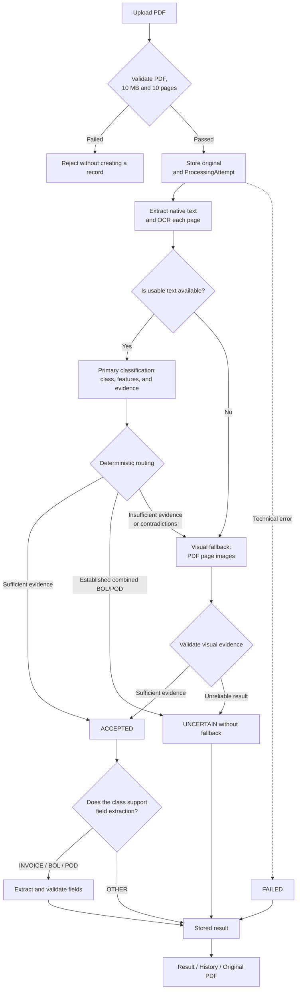

# Logistics Document Classifier

## Project Overview

This is a Django application for classifying PDF documents used in American
logistics. A user uploads a single PDF through the web interface, after which
the system analyzes the document, determines its type, and stores the result
together with the original file.

The application supports text-based and scanned PDFs and distinguishes four
classes:

- `INVOICE` — an invoice for transportation or logistics services;
- `BOL` — Bill of Lading;
- `POD` — Proof of Delivery;
- `OTHER` — a document that does not belong to the three target classes.

If the available evidence is insufficient or the document has an established
semantic ambiguity, the system does not guess the class and returns
`UNCERTAIN`. Technical errors are handled separately with the `FAILED` status.

## Project Goal

The goal is to build a clear end-to-end process for handling logistics
documents: from uploading a PDF to verifiable classification, extraction of
key fields, and subsequent review of the stored result.

The system's key principle is that the language model identifies structured
features and evidence in the document, while the backend uses deterministic
rules to decide whether the result can be accepted. The routing score indicates
the completeness of critical evidence, not the statistical probability that
the class is correct.

## What Is Implemented

- upload of a single PDF through the Django UI;
- validation of the PDF structure, size up to 10 MB, and page count up to 10;
- support for PDFs with a text layer and scanned documents;
- local OCR of each page using Tesseract;
- classification into `INVOICE`, `BOL`, `POD`, or `OTHER`;
- evidence-based routing with backend score calculation;
- one visual fallback if the text/OCR classification result cannot be
  accepted;
- separate `ACCEPTED`, `UNCERTAIN`, and `FAILED` states;
- separate behavior for combined BOL/POD documents;
- extraction of class-specific fields for accepted `INVOICE`, `BOL`, and
  `POD` documents;
- validation of evidence, date formats, amounts, and identifiers;
- explainable confidence for extracted fields;
- storage of the result, metadata, and original PDF;
- result, upload history, and original file viewing pages;
- automated tests and a command for evaluation against prepared manifests.

## How the Application Works



## Main Processing Flow

1. **Document intake.** The user selects a PDF in the web interface. The
   system validates the file's content and structure, not only its extension
   or MIME type.
2. **Processing attempt creation.** A valid PDF is stored in local media, and
   a separate `ProcessingAttempt` is created in PostgreSQL. Uploading the same
   file again creates a new attempt.
3. **Text extraction.** For each page, the system reads native PDF text and
   performs local OCR in parallel. The more meaningful version of the page
   text is selected for further processing.
4. **Primary classification.** The OpenAI model returns a candidate class,
   class-specific features, and evidence. The model does not determine the
   final status or assign a confidence score.
5. **Routing.** The backend validates the structure and source of the
   evidence, calculates critical-feature coverage, and makes one of three
   decisions: accept the class, finish processing as semantically ambiguous,
   or run the visual fallback.
6. **Visual fallback.** If the text result is insufficient, the model analyzes
   images of all pages from the original PDF once. The result goes through
   backend routing again and is not accepted automatically.
7. **Field extraction.** For accepted `INVOICE`, `BOL`, and `POD` documents,
   the system extracts a defined set of fields. Values, evidence, formats, and
   simple contradictions are validated separately. An extraction error does
   not change an already accepted document classification.
8. **Result storage.** The user sees the final status, class, score, fallback
   information, and extracted fields. The result and original PDF can be
   accessed again from the history page.

## Main Components

| Component | Responsibility |
|---|---|
| Django application layer | Upload form, views, URL routes, templates, and result storage |
| PDF/OCR services | PDF validation, native text extraction, page rendering, and local OCR |
| AI layer | Building OpenAI requests, structured output, and response validation |
| Routing service | Deterministic decision between `ACCEPTED`, fallback, and `UNCERTAIN` |
| PostgreSQL and local media | Metadata, processing results, and original PDFs |

The project intentionally remains a monolithic Django application with
synchronous processing. For the current scope, there are no separate worker
processes, queues, or external file storage.

## Technologies

| Category | Technologies Used |
|---|---|
| Backend | Python 3.14, Django 5.2 LTS |
| Database | PostgreSQL 18, Psycopg 3 |
| AI | OpenAI Responses API, Structured Outputs |
| PDF | pypdf, pypdfium2 |
| OCR | Tesseract, pytesseract |
| Test PDFs | ReportLab |
| Local infrastructure | Docker Compose for PostgreSQL |

## Local Setup

### Prerequisites

Before you begin, install:

- Git;
- Python 3.14;
- Docker Desktop or Docker Engine with Compose;
- Tesseract OCR with English language data;
- an OpenAI API key.

Install Tesseract on macOS:

```sh
brew install tesseract
```

On Ubuntu/Debian:

```sh
sudo apt update
sudo apt install tesseract-ocr
```

### 1. Clone the Repository

```sh
git clone https://github.com/hannamasheiko/logistics-document-classifier.git
cd logistics-document-classifier
```

### 2. Create a Virtual Environment

macOS or Linux:

```sh
python3.14 -m venv .venv
source .venv/bin/activate
```

Windows PowerShell:

```powershell
py -3.14 -m venv .venv
.venv\Scripts\Activate.ps1
```

After activation, `(.venv)` usually appears at the beginning of the command
line.

### 3. Install Python Dependencies

```sh
python -m pip install --upgrade pip
python -m pip install -r requirements.txt
```

### 4. Configure Environment Variables

Create a local `.env` from the provided example:

```sh
cp .env.example .env
```

Open `.env` and replace the placeholder values. Be sure to add your own
`OPENAI_API_KEY`. Do not commit `.env` or add the key to the repository.

Before starting Django, load the variables into the current shell session:

```sh
set -a
source .env
set +a
```

Docker Compose reads `.env` automatically, but Django does not load this file
by itself. The `source .env` commands must be repeated in each new shell
session.

In Windows PowerShell, the variables from `.env` must be set manually in the
current session or through the IDE run configuration.

### 5. Start PostgreSQL

```sh
docker compose up -d
```

Check the container status:

```sh
docker compose ps
```

### 6. Apply Migrations

```sh
python manage.py migrate
```

### 7. Check the Configuration

```sh
python manage.py check
```

Expected result:

```text
System check identified no issues (0 silenced).
```

### 8. Start the Application

```sh
python manage.py runserver
```

Open in your browser:

```text
http://127.0.0.1:8000/
```

On the home page, select a PDF and click **Upload**. After processing is
complete, the application opens the result page. The history is available at
`http://127.0.0.1:8000/history/`.

### 9. Stop the Local Database

After you finish working, stop the PostgreSQL container:

```sh
docker compose down
```

The stored data remains in the Docker volume and will be available after the
next `docker compose up -d`.

## Running Tests

The tests require PostgreSQL to be running:

```sh
python manage.py test documents.tests
```

Additional checks before submission:

```sh
python manage.py check
python manage.py makemigrations --check --dry-run
```

The automated tests do not make live OpenAI calls: the external AI boundary
is replaced with controlled responses. Separate PDF/OCR tests use local
fixtures and the installed Tesseract.

### Evaluating against a manifest

Beyond the unit tests, `evaluate_documents` runs the same production pipeline
against a labeled set of real documents, using live OpenAI calls:

```sh
python manage.py evaluate_documents \
  --manifest evaluation/manifest.json \
  --output evaluation/results/report.json \
  --run-live
```

Without `--run-live` it only validates the manifest, at no API cost. Every
attempt it creates is deleted afterward, so evaluation runs never affect the
shared demo history. Reports in `evaluation/results/` are sanitized (counts
and outcomes only, no raw document text).

## Evaluation

131 automated tests (92 in `documents.tests`, 39 in `experiments/tests`) pass
without live API calls. The classification and extraction pipeline has also
been evaluated with live OpenAI calls against two labeled document sets via
`evaluate_documents`:

| Set | Documents | Accepted correctly | Expected escalation | Semantic uncertainty (correct) | Accepted incorrectly | Technical failures |
|---|---|---|---|---|---|---|
| manifest-v1 (tuning) | 22 | 16 | 3 | 2 | 1 | 0 |
| manifest-v2 (held-out) | 12 | 10 | 1 | 1 | 0 | 0 |

Field extraction matched 27 of 27 expected values across 5 labeled examples.

These sets are small, hand-labeled examples meant to check the pipeline's
behavior end to end, not a calibrated production benchmark or a statistically
representative sample of real-world documents.

Full reports: [evaluation/results/final-v1.json](evaluation/results/final-v1.json),
[final-v2.json](evaluation/results/final-v2.json).

## Limitations

- Processing is performed synchronously within the HTTP request.
- History is shared among all users: the current version has no
  authentication.
- Original PDFs are stored locally in `media/`.
- The routing score and field confidence are explainable indicators of
  evidence quality, not calibrated probabilities.
- Visual evidence describes what is seen on the page and cannot be validated
  as an exact text quotation; evaluation testing found a case where it quoted
  a real section label but misread whether that section actually had content.
- Real uploaded text and images are sent to the OpenAI API without automatic
  masking of sensitive data.

## Additional Documentation

- [System design](docs/superpowers/specs/2026-09-16-document-classifier-design.md)
- [Implementation plan](docs/superpowers/plans/2026-09-16-document-classifier-implementation-plan.md)
- [Field extraction contract](docs/decisions/field-extraction-contract.md)
- [Primary confidence experiment](docs/experiments/primary-confidence.md)
- [OCR and visual fallback experiment](docs/experiments/scanned-fallback.md)
- [AI-assisted workflow description in Ukrainian](AI_WORKFLOW_UA.md)
