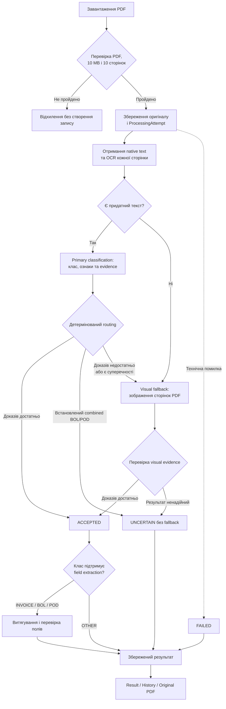

# Класифікатор логістичних документів

## Опис проєкту

Це Django-застосунок для класифікації PDF-документів, які використовуються в
американській логістиці. Користувач завантажує один PDF через вебінтерфейс,
після чого система аналізує документ, визначає його тип і зберігає результат
разом з оригінальним файлом.

Застосунок підтримує текстові та скановані PDF і розрізняє чотири класи:

- `INVOICE` — рахунок за транспортні або логістичні послуги;
- `BOL` — Bill of Lading;
- `POD` — Proof of Delivery;
- `OTHER` — документ, який не належить до трьох цільових класів.

Якщо наявних доказів недостатньо або документ має встановлену семантичну
неоднозначність, система не вгадує клас, а повертає `UNCERTAIN`. Технічні
помилки обробляються окремо зі статусом `FAILED`.

## Мета проєкту

Мета — побудувати зрозумілий end-to-end процес обробки логістичних документів:
від завантаження PDF до перевірюваної класифікації, витягування основних полів
і повторного перегляду збереженого результату.

Ключовий принцип системи: мовна модель знаходить структуровані ознаки та
докази в документі, а backend за детермінованими правилами вирішує, чи можна
прийняти результат. Routing score показує повноту критичних доказів, а не
статистичну ймовірність правильності класу.

## Що реалізовано

- завантаження одного PDF через Django UI;
- перевірка структури PDF, розміру до 10 MB і кількості до 10 сторінок;
- підтримка PDF із текстовим шаром і сканованих документів;
- локальне OCR кожної сторінки за допомогою Tesseract;
- класифікація в `INVOICE`, `BOL`, `POD` або `OTHER`;
- evidence-based routing із backend-розрахунком score;
- один visual fallback, якщо результат текстової/OCR-класифікації не можна
  прийняти;
- окремі стани `ACCEPTED`, `UNCERTAIN` і `FAILED`;
- окрема поведінка для комбінованих BOL/POD документів;
- витягування class-specific полів для прийнятих `INVOICE`, `BOL` і `POD`;
- перевірка evidence, форматів дат, сум та ідентифікаторів;
- пояснюваний confidence для витягнутих полів;
- збереження результату, metadata й оригінального PDF;
- сторінки результату, історії завантажень і перегляду оригіналу;
- автоматизовані тести та команда для evaluation на підготовлених маніфестах.

## Як працює застосунок



## Основний процес обробки

1. **Приймання документа.** Користувач вибирає PDF у вебінтерфейсі. Система
   перевіряє вміст і структуру файла, а не лише його розширення або MIME type.
2. **Створення спроби обробки.** Валідний PDF зберігається в local media, а в
   PostgreSQL створюється окремий `ProcessingAttempt`. Повторне завантаження
   того самого файла створює нову спробу.
3. **Отримання тексту.** Для кожної сторінки система читає native PDF text і
   паралельно виконує локальне OCR. Для подальшої обробки вибирається
   змістовніший варіант тексту сторінки.
4. **Primary classification.** OpenAI model повертає candidate class,
   class-specific ознаки та evidence. Модель не визначає фінальний статус і
   не задає confidence score.
5. **Routing.** Backend перевіряє структуру та джерело evidence, розраховує
   покриття критичних ознак і приймає одне з рішень: прийняти клас, завершити
   обробку як семантично неоднозначну або запустити visual fallback.
6. **Visual fallback.** Якщо текстового результату недостатньо, модель один
   раз аналізує зображення всіх сторінок оригінального PDF. Результат знову
   проходить backend routing і не приймається автоматично.
7. **Field extraction.** Для прийнятих `INVOICE`, `BOL` і `POD` система
   витягує визначений набір полів. Значення, evidence, формат і прості
   суперечності перевіряються окремо. Помилка extraction не змінює вже
   прийняту класифікацію документа.
8. **Збереження результату.** Користувач бачить фінальний статус, клас, score,
   інформацію про fallback і витягнуті поля. До результату й оригінального PDF
   можна повернутися зі сторінки історії.

## Основні компоненти

| Компонент | Відповідальність |
|---|---|
| Django application layer | Upload form, views, URL routes, templates і збереження результатів |
| PDF/OCR services | Перевірка PDF, отримання native text, рендеринг сторінок і локальне OCR |
| AI layer | Формування запитів до OpenAI, structured output і перевірка відповідей |
| Routing service | Детерміноване рішення між `ACCEPTED`, fallback та `UNCERTAIN` |
| PostgreSQL та local media | Metadata, результати обробки й оригінальні PDF |

Проєкт навмисно залишається монолітним Django-застосунком із синхронною
обробкою. Для поточного обсягу немає окремих worker-процесів, черг або
зовнішнього файлового сховища.

## Технології

| Категорія | Використані технології |
|---|---|
| Backend | Python 3.14, Django 5.2 LTS |
| База даних | PostgreSQL 18, Psycopg 3 |
| AI | OpenAI Responses API, Structured Outputs |
| PDF | pypdf, pypdfium2 |
| OCR | Tesseract, pytesseract |
| Тестові PDF | ReportLab |
| Локальна інфраструктура | Docker Compose для PostgreSQL |

## Локальний запуск

### Передумови

Перед початком установіть:

- Git;
- Python 3.14;
- Docker Desktop або Docker Engine із Compose;
- Tesseract OCR з англійськими мовними даними;
- OpenAI API key.

Встановлення Tesseract на macOS:

```sh
brew install tesseract
```

На Ubuntu/Debian:

```sh
sudo apt update
sudo apt install tesseract-ocr
```

### 1. Клонування репозиторію

```sh
git clone https://github.com/hannamasheiko/logistics-document-classifier.git
cd logistics-document-classifier
```

### 2. Створення virtual environment

macOS або Linux:

```sh
python3.14 -m venv .venv
source .venv/bin/activate
```

Windows PowerShell:

```powershell
py -3.14 -m venv .venv
.venv\Scripts\Activate.ps1
```

Після активації на початку командного рядка зазвичай з'являється `(.venv)`.

### 3. Встановлення Python dependencies

```sh
python -m pip install --upgrade pip
python -m pip install -r requirements.txt
```

### 4. Налаштування environment variables

Створіть локальний `.env` із готового прикладу:

```sh
cp .env.example .env
```

Відкрийте `.env` і замініть placeholder values. Обов'язково додайте власний
`OPENAI_API_KEY`. Не комітьте `.env` і не передавайте ключ у репозиторій.

Перед запуском Django завантажте змінні в поточну shell session:

```sh
set -a
source .env
set +a
```

Docker Compose автоматично читає `.env`, але Django не завантажує цей файл
самостійно. Команди `source .env` потрібно повторити в новій shell session.

У Windows PowerShell змінні з `.env` потрібно встановити в поточній сесії
вручну або через конфігурацію запуску IDE.

### 5. Запуск PostgreSQL

```sh
docker compose up -d
```

Перевірити стан контейнера:

```sh
docker compose ps
```

### 6. Застосування міграцій

```sh
python manage.py migrate
```

### 7. Перевірка конфігурації

```sh
python manage.py check
```

Очікуваний результат:

```text
System check identified no issues (0 silenced).
```

### 8. Запуск застосунку

```sh
python manage.py runserver
```

Відкрийте у браузері:

```text
http://127.0.0.1:8000/
```

На головній сторінці виберіть PDF і натисніть **Upload**. Після завершення
обробки застосунок відкриє сторінку результату. Історія доступна за адресою
`http://127.0.0.1:8000/history/`.

### 9. Зупинка локальної бази даних

Після завершення роботи зупиніть контейнер PostgreSQL:

```sh
docker compose down
```

Збережені дані залишаться у Docker volume і будуть доступні після наступного
`docker compose up -d`.

## Запуск тестів

Для тестів потрібна запущена PostgreSQL:

```sh
python manage.py test documents.tests
```

Додаткові перевірки перед здачею:

```sh
python manage.py check
python manage.py makemigrations --check --dry-run
```

Автоматизовані тести не виконують live OpenAI calls: зовнішня AI-boundary у
них замінюється контрольованими відповідями. Окремі PDF/OCR-тести працюють із
локальними fixtures і встановленим Tesseract.

## Обмеження

- Обробка виконується синхронно в межах HTTP request.
- Історія спільна для всіх користувачів: authentication у поточній версії
  немає.
- Оригінальні PDF зберігаються локально в `media/`.
- Routing score та field confidence є пояснюваними сигналами якості evidence,
  а не каліброваними ймовірностями.
- Visual evidence є описом побаченого на сторінці й не може бути перевірене як
  точна текстова цитата.
- Реальні завантажені тексти та зображення надсилаються до OpenAI API без
  автоматичного маскування чутливих даних.

## Додаткова документація

- [Дизайн системи](docs/superpowers/specs/2026-09-16-document-classifier-design.md)
- [План реалізації](docs/superpowers/plans/2026-09-16-document-classifier-implementation-plan.md)
- [Контракт field extraction](docs/decisions/field-extraction-contract.md)
- [Експеримент із primary confidence](docs/experiments/primary-confidence.md)
- [Експеримент з OCR і visual fallback](docs/experiments/scanned-fallback.md)
- [Опис AI-assisted workflow українською](AI_WORKFLOW_UA.md)
